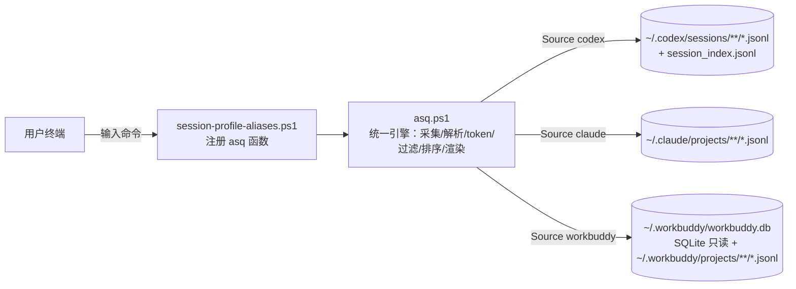
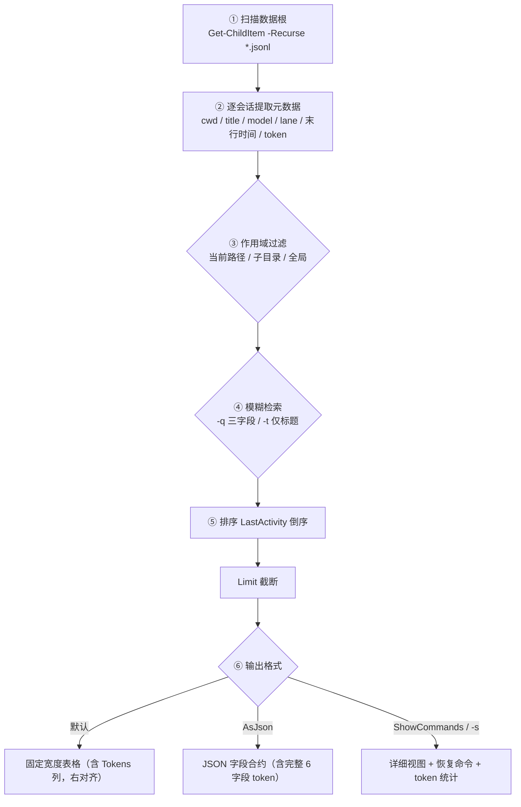

# AgentsSessionQuery 会话查询工具（asq）

一套只读、零写入的 PowerShell 工具，用于在本机列出、检索、查看 **OpenAI Codex**、**Claude Code** 与 **WorkBuddy** 写入本地的会话（session）记录。统一命令 `asq` 以 `-Source codex|claude|workbuddy`（或位置参数形式 `asq codex -g`）分派三数据源，全部采集 / 解析 / 过滤 / 排序 / 渲染逻辑收敛于单一引擎 `asq.ps1`。可在项目目录里快速回看「这个项目我之前跑过哪些会话」。

AgentsSessionQuery 源于在 Codex / Claude / WorkBuddy 多客户端间统一查阅本机会话记录的实际需求，演进为以 `asq` 单一引擎驱动的统一命令；**v1.0.0 为首次对公开发布版本**。

> 本仓库只提供一个用户入口 `asq`：`asq.ps1` 为引擎本体，`session-profile-aliases.ps1` 将其注册为 `asq` 函数供 Profile 点加载；定位为可独立分发的轻量工具包。

---

## 特性

- **单命令多数据源**：`asq codex`（读 `~/.codex`）、`asq claude`（读 `~/.claude`）、`asq workbuddy`（读 `~/.workbuddy/workbuddy.db`，SQLite 只读）。
- **工作区语义**：默认按「当前 PowerShell 路径」筛选会话；`-Global` 取消限制，`-IncludeSubdirectories` 扩大到子目录。
- **模糊检索**：`-q` 按 SessionId / Title / WorkspacePath 三字段统一筛选；`-t` 仅按标题筛选。
- **模型可见**：Codex 显示会话最后使用的主代理模型；Claude 显示每会话最后实际跑的真实模型（及可选的路由名）。
- **可恢复**：`-c` 详细视图与 `-s` 单会话详情直接给出可复制的 `codex resume …` / `claude --resume …` 恢复命令。
- **脚本化友好**：`-AsJson` 输出完整字段合约，便于管道与集成。
- **中文友好**：表格按 Unicode 文本元素计算显示宽度，长标题/长路径中间截断为 `...`，中英文混排不错位。
- **Token 统计**：列表视图 `Tokens` 列（会话累计 token，千分位，**右对齐**）；`-c` 详细视图与 `-AsJson` 输出完整 6 字段——`Tokens` / `InputTokens` / `OutputTokens` / `CacheReadTokens` / `CacheWriteTokens` / `ReasoningTokens`（codex / claude / **WorkBuddy** 口径一致）；`Tokens` 均等于各分量之和（不读厂商 `total_tokens`），Claude 额外覆盖 `agent-*` 子智能体会话，WorkBuddy 额外覆盖软删除与 `agent-*` 子智能体会话。逐会话 6 字段口径一致、全局总量校验闭合。
- **可移植与健壮**：数据源三态检测（未安装 / 已装未用 / 已用）分别给出友好提示并 `exit 0`；在 Windows PowerShell 5.1 下运行会温和告警建议改用 PowerShell 7（避免中文乱码）；所有数据源经 `$HOME` 解析、零硬写用户名/盘符，WorkBuddy 的 Python 运行时路径版本无关（扫描 `versions/*` 取最高版），复制到别的机器也能运行。

---

## 架构



要点：所有实现集中于 `asq.ps1` 单一真源，按 `-Source` 分派三数据源；`session-profile-aliases.ps1` 仅把引擎注册为 `asq` 函数。曾有的三个子命令（`codex-sessions` / `claude-sessions` / `workbuddy-sessions`）转发 wrapper 已退役删除。

---

## 环境要求

- **必需**：PowerShell 7（`pwsh`）。在 Windows PowerShell 5.1（Desktop 版）下运行会输出告警，且 5.1 对含中文的测试文本解析存在乱码风险，建议优先使用 `pwsh`。
- **可选（缺失即优雅降级）**：
  - `claude` / `codex` CLI：仅影响「打印的恢复命令」能否真正执行，不影响列表功能；
  - Python：仅 WorkBuddy 工具在解析 transcript 与打开 SQLite 时需要（优先 `python`/`py` 探测 PATH，最后回退本机 `$HOME` 相对路径 `~/.workbuddy/binaries/python/versions/*/python.exe` 取最高版）。

---

## 安装

获取脚本仓库后，有两种使用方式。

### 方式 A：直接运行（零安装）

无需任何配置，每次用 `pwsh -File` 调用脚本本体：

```powershell
pwsh -File ./asq.ps1 codex -g
pwsh -File ./asq.ps1 claude -g -AsJson
pwsh -File ./asq.ps1 -Source workbuddy -g    # 命名参数形式
```

- 优点：零门槛、不改 Profile。
- 缺点：没有 `asq` 这种命令名，每次需带 `-File` 与路径；参数完全可用。

### 方式 B：Profile 接入（推荐，体验最佳）

把 `session-profile-aliases.ps1` 点加载进 PowerShell Profile，注册出 `asq` 函数，之后新开终端即可直接用 `asq codex -g` 这类形式。

**建议安装路径（按平台，任选其一固定放置仓库）**：

| 平台 | 推荐路径 | 说明 |
| --- | --- | --- |
| Windows (pwsh 用户级) | `~\Documents\PowerShell\SessionTools\` | 与 pwsh `$PROFILE` 同体系，无需管理员 |
| Windows (通用) | `~\scripts\` 或 `~/.local/scripts/` | 任意固定路径，Profile 指向它 |
| Linux / macOS | `~/.local/share/scripts/` | 与 `$HOME` 体系一致 |

**接入步骤**（在 `$PROFILE` 末尾追加一行，幂等）：

```powershell
# 请将路径替换为你的实际仓库位置
. "$HOME/scripts/session-profile-aliases.ps1"
```

保存后重载 Profile：`. $PROFILE`，即可使用 `asq`。

> ⚠️ **Windows 双 Profile 注意**：本机有 **pwsh 7** 与 **Windows PowerShell 5.1** 两套 `$PROFILE`。日常若用 pwsh，需把点加载行写入 `~\Documents\PowerShell\Microsoft.PowerShell_profile.ps1`；若也要在 WinPS 5.1 下使用，须同步写入 `~\Documents\WindowsPowerShell\Microsoft.PowerShell_profile.ps1`。只写一套会导致「装了却命令不识别」。

---

## 文件清单

| 文件 | 角色 |
| --- | --- |
| `asq.ps1` | AgentsSessionQuery 引擎（唯一真源：采集/token 解析/过滤/排序/渲染，按 -Source 分派 codex/claude/workbuddy） |
| `session-profile-aliases.ps1` | 把 asq.ps1 注册为 `asq` 函数供 Profile 点加载 |

---

## 快速开始

```powershell
# 默认：当前路径下最近 20 条 Codex 会话
asq codex

# 全局 Codex 会话（含 Tokens 列，右对齐）
asq codex -g

# 当前路径下最近 20 条 Claude 会话（含 Tokens 列）
asq claude

# 指定某条 Claude 会话的完整详情（跨项目，忽略路径过滤）
asq claude -s <session-id>

# 输出 JSON 供脚本集成（含完整 token 字段）
asq codex -g -AsJson
asq claude -g -AsJson
# 命名参数形式（等价于位置参数写法）
asq -Source workbuddy -g -c
```

若未通过 Profile 注册 `asq`，请用方式 A 的 `pwsh -File ./asq.ps1 …` 形式调用（见安装章节）。

---

## 通用参数

三个数据源的参数几乎一致（Claude / WorkBuddy 各多一个 `-s/-SessionId`；WorkBuddy 额外有 `-Type` 按任务 / 空间筛选）。

| 参数 | 别名 | 说明 |
| --- | --- | --- |
| `-Limit <N>` | `-n` | 输出条数，默认 20；也可直接写数字 `asq codex 50` |
| `-Global` | `-g` | 显示全局会话，不按当前路径筛选 |
| `-IncludeSubdirectories` | `-r` | 当前路径筛选包含子目录会话 |
| `-WorkspacePath <路径>` | — | 指定用于筛选的工作区路径（默认当前 PowerShell 路径） |
| `-q <词>` | — | 按 SessionId / Title / WorkspacePath 统一模糊筛选 |
| `-t <词>` | `-TitleLike` | 仅按 Title 模糊筛选 |
| `-s <id>` | `-SessionId` | （仅 Claude / WorkBuddy）查看指定会话完整详情，跨项目查找 |
| `-SortBy <字段>` | `-o` | `LastActivity`（默认）/ `WorkspacePath` |
| `-ShowCommands` | `-c` | 详细视图（含路径、恢复命令、分支、模式、消息数、**token 统计**等） |
| `-AsJson` | — | 输出 JSON 字段合约（含完整 token 字段） |
| `-Help` | `-h` / `-?` / `--help` | 显示帮助 |
| `-Type <任务\|空间>` | — | （仅 WorkBuddy）按任务 / 空间筛选会话 |
| `-DbPath <路径>` | — | （仅 WorkBuddy）指定 SQLite 数据库路径（默认 `~/.workbuddy/workbuddy.db`） |

---

## 输出列与字段语义

### asq codex（读 `~/.codex`）

| 列 | 含义 | 来源 |
| --- | --- | --- |
| `Lane` | `Codex` / `OMX`（基于痕迹的实用判定，非官方硬标签） | `session_meta.payload.base_instructions` 含 `oh-my-codex` / `omx:generated:agents-md` / `OMX` 标记则判为 `OMX` |
| `SessionId` | 会话真实 ID（UUID） | transcript 文件名 |
| `LastActivity` | 最近活动时间 | `session_index.jsonl` 更新时间 / 文件时间 |
| `Title` | 会话标题 | `session_index.jsonl` 的 `thread_name` |
| `Model` | 会话最后使用的主代理模型 | transcript 的 `turn_context.payload.model`，过滤图像生成 / `<synthetic>` / `openrouter/free`；无则空 |
| `Tokens` | 会话累计 token 总量（千分位，右对齐） | transcript token 事件；**v1.2.6 起采用 stateful-delta 解析**（`last_token_usage` 增量主源 + `total_token_usage` 去重 + `cache_read=min(cached,input)` 重建恒等总量） |
| `WorkspacePath` | 真实工作区路径 | `session_meta.payload.cwd`；列宽紧张时中间截断 `...` |

`-c` / `-s` / `-AsJson` 额外 token 字段：`InputTokens`、`OutputTokens`、`CacheReadTokens`、`CacheWriteTokens`、`ReasoningTokens`。其余既有字段：`GitBranch`、`Mode`、`MessageCount`、`TranscriptPath`、`ResumeCommand`。

### asq claude（读 `~/.claude`）

| 列 | 含义 | 来源 |
| --- | --- | --- |
| `SessionId` | 会话真实 UUID（或子智能体 transcript 文件名） | transcript 文件名（递归扫描 `~/.claude/projects/**/*.jsonl`，**含 `agent-*` 子智能体**，排除 `subagents/journal.jsonl`） |
| `LastActivity` | 最近活动时间（UTC 转本地） | transcript 末行 `timestamp`；缺失则文件时间 |
| `Title` | 会话标题 | transcript 首个 `custom-title`（用 `/rename` 或 `-n` 设置的名称）；**无则留空**，不回退到 prompt 或 SessionId；子智能体取自 `.meta.json` 的 `agentType`（前缀「子智能体:」） |
| `Model` | 该会话最后实际跑的真实模型 | transcript 嵌套 `message.model`（滚动 last_model 兜底，排除 `<synthetic>`），末值经模型名规范化（同模型不同拼写归为标准名）；如 `k3-256k`、`moonshotai/kimi-k3` |
| `Tokens` | 会话累计 token 总量（千分位，右对齐） | **v1.2.8 起**逐行 `(message.id, requestId)` 去重 + 各分量 MAX 合并后求和：`input+output+cache_read+cache_write`（Claude 无 reasoning 桶，恒为 0），不再读 `usage.total_tokens`；**v1.2.9 起覆盖 `agent-*` 子智能体会话** |
| `WorkspacePath` | 真实工作区路径 | transcript 的 `cwd`；列宽紧张时中间截断 `...` |

`-c` / `-s` / `-AsJson` 额外 token 字段：`InputTokens`、`OutputTokens`、`CacheReadTokens`、`CacheWriteTokens`、`ReasoningTokens`（Claude 的 `ReasoningTokens` 恒为 0）。其余既有字段：`GitBranch`、`Mode`、`MessageCount`、`TranscriptPath`、`ResumeCommand`、`RoutingName`（当前 Claude 全局配置的原始 `model` id，如 `claude-fable-5[1m]`，属全局配置、各会话相同，作对照参考）。

### asq workbuddy（读 `~/.workbuddy`）

| 列 | 含义 | 来源 |
| --- | --- | --- |
| `Type` | 派生列：`任务`（沙盒/后台自动化）/ `空间`（真实项目） | `is_playground` / `is_background_automation` 标志派生；`agent-*` 子智能体合成会话归「任务」 |
| `SessionId` | 会话真实 ID（或子智能体 transcript 标识） | `sessions.id`（DB 行）或 transcript 文件名（合成会话） |
| `LastActivity` | 最近活动时间（epoch 毫秒转本地） | `last_activity_at` → `updated_at` → `created_at`（有 DB 行者） |
| `Title` | 会话标题 | `custom_title` 优先，回退 `title`；软删除会话附 `[已软删除]`；子智能体前缀「子智能体: <id>」 |
| `Model` | 会话模型 | `sessions.model`（有 DB 行者）；合成会话无 |
| `Tokens` | 会话累计 token 总量（千分位，右对齐） | **v1.0.4 起解析 `projects/*.jsonl` transcript** 计算（行筛 + status 跳过 + usage 取法优先级 + `input_exclusive` 缓存减法 + reasoning 桶 + 去重保留较大 total）；**v1.0.5 起采集范围扩展为全部 `projects/**/*.jsonl` transcript**（含软删除会话与 `agent-*` 子智能体） |
| `WorkspacePath` | 真实工作区路径 | `sessions.cwd`（有 DB 行者）；列宽紧张时中间截断 `...` |

`-c` / `-s` / `-AsJson` 额外 token 字段：`InputTokens`、`OutputTokens`、`CacheReadTokens`、`CacheWriteTokens`、`ReasoningTokens`（v1.0.4 起补齐，与 codex/claude 口径一致；`CACHE_READ_KEYS`/`CACHE_WRITE_KEYS` 覆盖 `cache_read_input_tokens`/`cache_creation_input_tokens`/`prompt_cache_hit_tokens` 等键；`Input` 已扣除缓存命中，五分量之和恒等于 `Tokens`）。其余既有字段：`Type`、`Title`、`Model`、`LastActivity`、`WorkspacePath`。

---

## 查询原理



自 v0.2 统一命令重构起，扫描 / 解析 / token / 过滤 / 排序 / 渲染已集中于 `asq.ps1` 单一实现（各数据源专属逻辑亦在该文件内）；曾兼容的三个子命令转发层后续已退役删除。README 列含义表格不变。

**字段来源速查**：

| 字段 | Codex 来源 | Claude 来源 | WorkBuddy 来源 |
| --- | --- | --- | --- |
| SessionId | transcript 文件名（UUID） | transcript 文件名（UUID / `agent-*`） | `sessions.id`（或合成 transcript 标识） |
| Title | `session_index.jsonl` 的 `thread_name` | 首个 `custom-title`，无则留空 | `custom_title` 优先、回退 `title` |
| WorkspacePath | `session_meta.payload.cwd` | 每行 `cwd` | `sessions.cwd` |
| Lane / Type | `base_instructions` 痕迹判 `Codex/OMX` | 用 `mode` 区分 | `is_playground`/`is_background_automation` 派生 |
| Model | `turn_context.payload.model`（过滤 synthetic/image） | 末行 `message.model` | `sessions.model` |
| LastActivity | `session_index` 更新时间 / 文件时间 | 末行 `timestamp`（UTC→本地） | `last_activity_at`→`updated_at`→`created_at` |
| Tokens | stateful-delta 解析（增量主源 + 去重） | 去重 + 分量之和（含 `agent-*`） | 全部 `projects/*.jsonl` transcript 解析 |

---

## 设计原则

- **只读、零写入**：工具只读取 AI 客户端自己落盘的 JSONL / SQLite，绝不修改 transcript 或数据库（WorkBuddy 以 `?mode=ro` 只读 URI 打开）。
- **容错优先**：逐行解析 JSONL，「坏行 / 缺字段 / 编码异常 → 跳过并继续」，单个损坏会话不拖垮整体扫描。
- **工作区语义**：默认以「当前 PowerShell 路径」为作用域，贴合「在项目目录里看本项目历史」的真实心智。
- **展示自适应**：文本表格按 Unicode 文本元素计算显示宽度；`Tokens` 列右对齐、`-c` 明细标签统一宽度 17；脚本化集成用 `-AsJson` 输出完整字段合约。
- **编码健壮**：显式 UTF-8 读取，并对历史 GBK→UTF-8 mojibake 自动修复（仅 Codex 侧需要）。
- **可移植**：数据源三态检测 + PowerShell 5.1 告警 + 全 `$HOME` 相对（零硬写用户名/盘符）+ WorkBuddy Python 运行时版本无关（扫描 `versions/*` 取最高版），复制到别的机器也能运行。

---

## 数据来源

- **Codex**：`~/.codex/sessions/**/*.jsonl` + `~/.codex/session_index.jsonl`
- **Claude**：`~/.claude/projects/**/*.jsonl`（递归扫描，含 `agent-*` 子智能体会话；排除 `subagents/journal.jsonl` 编排元数据）
- **WorkBuddy**：元数据来自 `~/.workbuddy/workbuddy.db`（SQLite 只读；DB 的 title/cwd/model 覆盖率 100%）；**token 数据自 v1.0.3 起改由 `~/.workbuddy/projects/*.jsonl` transcript 解析**（DB `session_usage.used` 仅作无 transcript 回退）；**v1.0.5 起全局扫描范围扩展为全部 `projects/**/*.jsonl` transcript**（含软删除会话与 `agent-*` 子智能体）。

注：本工具的会话数据采集路径（Codex `~/.codex/sessions`、Claude `~/.claude/projects/**/*.jsonl`、WorkBuddy `~/.workbuddy/projects/*.jsonl`）参考自 token-monitor 的数据采集范围。

---

## 已知限制

- 历史数据里可能存在坏行、缺字段或编码异常（已被容错策略跳过）。
- 部分会话无 `custom-title`，Claude 的 `Title` 会为空。
- Codex `Lane` 是基于痕迹的实用判定，不是官方元数据字段。
- `RoutingName` 为当前 Claude 全局配置的原始 `model` id（如 `claude-fable-5[1m]`），由 `~/.claude/settings.json` 的 `model` 字段直接取值、未经任何外部翻译（v1.2.5 起已移除对 `route_name.py` / `cc-switch.db` 的依赖，不再出现 `k3-256k` 这类友好路由名）；属全局配置、各会话相同，与逐会话的 `Model`（该会话实际跑过的真实模型）是两回事。
- WorkBuddy 无 CLI resume 入口，`asq workbuddy` 不提供恢复命令。
- **Token 统计属「尽力而为」**：逐会话 6 字段（Tokens / Input / Output / CacheRead / CacheWrite / Reasoning）由 transcript 解析得出；若某会话 transcript 未上报或字段名未被兼容表覆盖，对应值为 `0`；兼容表已覆盖常见蛇形/驼峰/`<synthetic>`/`openrouter/free` 等变体。

---

## 范围说明

本 README 聚焦 AgentsSessionQuery 的统一会话查询命令 `asq`（`asq.ps1` 引擎 + `session-profile-aliases.ps1` 注册的 `asq` 函数），覆盖 codex / claude / workbuddy 三数据源。

---

## 测试说明

本仓库的自动化测试（`tests/`）依赖本机真实的 `~/.claude`、`~/.codex` 与 `~/.workbuddy` 数据，**暂不随开源发布**：回归用例需在包含真实会话数据的本机环境运行，部分用例对真实数据排序敏感。开源交付物为：2 个脚本（`asq.ps1` / `session-profile-aliases.ps1`）+ 文档（`README.md` / `CHANGELOG.md` / `LICENSE` / `docs/v1.0.0-release-notes.md` 发布说明）。历史版本（v0.x）发布说明与内部开发文档不随开源发布。

---

## 许可

本项目以 MIT 许可证开源，详见仓库根目录的 `LICENSE` 文件。
